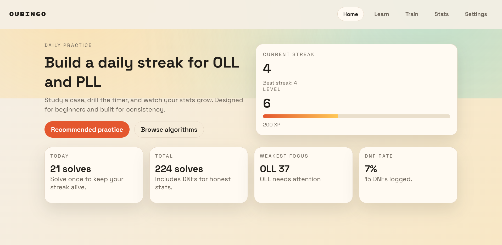

<!-- Improved compatibility of back to top link: See: https://github.com/othneildrew/Best-README-Template/pull/73 -->
<a id="readme-top"></a>

<!-- PROJECT SHIELDS -->
[![Contributors][contributors-shield]][contributors-url]
[![Forks][forks-shield]][forks-url]
[![Stargazers][stars-shield]][stars-url]
[![Issues][issues-shield]][issues-url]

<!-- PROJECT LOGO -->
<br />
<div>
  <h3>Cubingo</h3>

  <p>
    Cubingo turns learning 3x3 last layer algorithms into a daily practice game with streaks, levels, and smart recommendations.
    <br />
    <a href="https://github.com/krishvijay100/Cubingo"><strong>Explore the docs</strong></a>
    <br />
    <br />
    <a href="https://github.com/krishvijay100/Cubingo/issues/new?labels=bug&template=bug-report---.md">Report Bug</a>
    &middot;
    <a href="https://github.com/krishvijay100/Cubingo/issues/new?labels=enhancement&template=feature-request---.md">Request Feature</a>
  </p>
</div>

<!-- TABLE OF CONTENTS -->
<details>
  <summary>Table of Contents</summary>
  <ol>
    <li>
      <a href="#about-the-project">About The Project</a>
      <ul>
        <li><a href="#built-with">Built With</a></li>
      </ul>
    </li>
    <li>
      <a href="#getting-started">Getting Started</a>
      <ul>
        <li><a href="#prerequisites">Prerequisites</a></li>
        <li><a href="#installation">Installation</a></li>
      </ul>
    </li>
    <li><a href="#usage">Usage</a></li>
    <li><a href="#acknowledgments">Acknowledgments</a></li>
  </ol>
</details>

<!-- ABOUT THE PROJECT -->
## About The Project



There are 78 last layer algorithms (57 OLL + 21 PLL) on a 3x3, and learning them can feel daunting and tedious. Cubingo gamifies the process with Duolingo-style progression: streaks, leveling, and XP for consistent practice.

Cubingo adds unique training tools too. The recommended practice mode uses a weighting algorithm that considers recency, speed, and attempt count to suggest what you need most. Each case includes embedded YouTube videos for execution tips and finger tricks, plus a CS Timer-style drill timer for focused repetition. Progress is saved in `localStorage`, with built-in export/import so you can back up or move your data between devices.

<p align="right">(<a href="#readme-top">back to top</a>)</p>

### Built With

* [![HTML][HTML-shield]][HTML-url]
* [![CSS][CSS-shield]][CSS-url]
* [![JavaScript][JavaScript-shield]][JavaScript-url]

<p align="right">(<a href="#readme-top">back to top</a>)</p>

<!-- GETTING STARTED -->
## Getting Started

You can use the hosted app at https://cubingo.vercel.app or run it locally as a static site.

### Prerequisites

No build tools are required. Any modern browser works.

### Installation

1. Clone the repo
   ```sh
   git clone https://github.com/krishvijay100/Cubingo.git
   ```
2. Open `index.html` in your browser.

Optional: If you prefer a local server, you can use any static server (for example `npx serve`).

<p align="right">(<a href="#readme-top">back to top</a>)</p>

<!-- USAGE EXAMPLES -->
## Usage

- Learn: browse OLL/PLL cases, view diagrams, and mark algorithms as learned.
- Train: drill a selected case or use Recommended Practice to target weak spots.
- Stats: track best, median, Ao5, and mastery tier per algorithm.
- Settings: export/import progress JSON or reset stats.

_For more details, see the live app: https://cubingo.vercel.app_

<p align="right">(<a href="#readme-top">back to top</a>)</p>

<!-- ACKNOWLEDGMENTS -->
## Acknowledgments

* Inspiration from Duolingo-style streaks and leveling.
* Timer UX inspired by CS Timer.
* Embedded YouTube links are from the YouTuber SpeedCubeDB.

<p align="right">(<a href="#readme-top">back to top</a>)</p>

<!-- MARKDOWN LINKS & IMAGES -->
<!-- https://www.markdownguide.org/basic-syntax/#reference-style-links -->
[contributors-shield]: https://img.shields.io/github/contributors/krishvijay100/Cubingo.svg?style=for-the-badge
[contributors-url]: https://github.com/krishvijay100/Cubingo/graphs/contributors
[forks-shield]: https://img.shields.io/github/forks/krishvijay100/Cubingo.svg?style=for-the-badge
[forks-url]: https://github.com/krishvijay100/Cubingo/network/members
[stars-shield]: https://img.shields.io/github/stars/krishvijay100/Cubingo.svg?style=for-the-badge
[stars-url]: https://github.com/krishvijay100/Cubingo/stargazers
[issues-shield]: https://img.shields.io/github/issues/krishvijay100/Cubingo.svg?style=for-the-badge
[issues-url]: https://github.com/krishvijay100/Cubingo/issues
[HTML-shield]: https://img.shields.io/badge/HTML5-E34F26?style=for-the-badge&logo=html5&logoColor=white
[HTML-url]: https://developer.mozilla.org/en-US/docs/Web/HTML
[CSS-shield]: https://img.shields.io/badge/CSS3-1572B6?style=for-the-badge&logo=css3&logoColor=white
[CSS-url]: https://developer.mozilla.org/en-US/docs/Web/CSS
[JavaScript-shield]: https://img.shields.io/badge/JavaScript-F7DF1E?style=for-the-badge&logo=javascript&logoColor=000000
[JavaScript-url]: https://developer.mozilla.org/en-US/docs/Web/JavaScript
